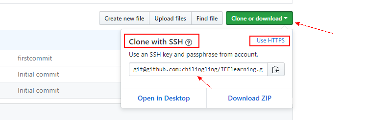

# 第一天的学习—— 总结下git的基本操作
1.环境：windows10
2.git版本：2.15.0.windows.1
#### 准备
- [注册github](https://github.com/join?source=header-home)
- [git安装](https://git-scm.com/downloads)
	- git安装完成之后，配置用户名和邮箱
	- `git config --global user.eamil "your email address"`  绑定邮箱
	- `git config --global user.name "you name"`  设置用户名
- 在windows生成并绑定ssh(方便以后的代码提交)
	- 安装完成git之后右键进入git Bash,输入命令行 `ssh-keygen -C'这里是你的邮箱' -t rsa` 
	- 然后就连续三个回车
	- 这时在你的c盘/用户/用户名文件夹下面应该就会找到一个ssh文件夹，在里面找到文件名为 ‘id_rsa.pub’的文件，打开并复制里面的内容
	- 在github用户的setting界面找到SSH and GPG keys,点击添加一个SSH key,即将上一步复制的内容粘贴进去，输入用户密码，就ok了
	- 正确绑定后，gitBash界面输入 `ssh -T git@github.com` ,正常结果会显示：

	```gitShell
		Warning: Permanently added the RSA host key for IP address '13.229.188.59' to the list of known hosts.
		Hi chilingling! You've successfully authenticated, but GitHub does not provide shell access.
	```

#### 新建项目(代码仓库)
- 在github里面新建项目就是 New repository操作
- 点击之后，你需要做的就是设置项目的名称，描述，以及协议（我选的是MIT）
- 接下来就是本地仓库跟github仓库连接,选择一个存放你的代码的本地文件夹，然后进入gitBash界面
	-  把仓库中的代码clone下来：`git clone https://(这里是的你github项目代码的地址)`或者`git clone git@github.com:....` 建议采用第二种，因为这样的话就不用每次push代码的时候都登录一下了
	- 
	-  将你的代码迁移到该文件夹下面，执行 `git add .`,将这些代码文件等等加入到git的监控中
	-  `git commit -m "这里可以填写注释，这一步是把代码提交到本地的git仓库"`
	-  `git push`  这里是将代码提交到远程仓库
一个大致的github创建项目、使用git上传代码到github的流程就这样，__但是这其中还有很多未知的冲突（错误在里面）。__
关于git的操作和错误的解决，可以百度或者Google，关于这些更深入的学习，可以看看参考链接

参考链接：
- [git Book](https://git-scm.com/book/zh/v2)
- [廖雪峰大大的教程](https://www.liaoxuefeng.com/wiki/0013739516305929606dd18361248578c67b8067c8c017b000/001373962845513aefd77a99f4145f0a2c7a7ca057e7570000)


