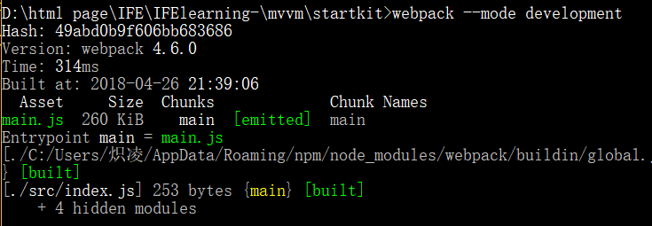
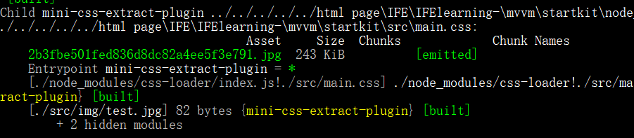
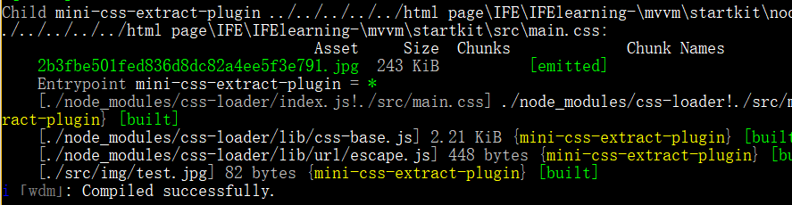

# 搭建开发环境
#### 基础
- 准备一个文件夹存放你的项目
- npm init -y 初始化你的项目
- 安装webpack  ~~`npm install webpack -g`  `npm install webpack-cli -g`~~`npm install webpack --save-dev`  `npm install webpack-cli --save-dev`
	为什么这里我弃用了全局安装的方式？没错，一开始我是采用全局安装的方式的，但是环境配置到了后面就出现了很多未名的错误，比如什么`module not find`，而局部安装就很友好。

- ~~将webpack链接至该项目中 `npm link webpack --save-dev`, `npm link webpack-cli --save-dev`~~
- 使用默认配置,在src文件夹下面新建index.js作为入口文件
- 写点东西测试一下  
	```Javascript
	import san from 'san'; //引入san
	var MyApp = san.defineComponent({
	template: '<p>Hello {{name}}!</p>',
	initData: function() {
		return {
			name: 'san'
		};
		}
	});
	var myApp = new MyApp();
	myApp.attach(document.body);
	```
- 使用命令行打包： 开发环境 `webpack --mode development`；生产环境`webpack --mode production` 
- 打包成功
- 

#### 进阶
- 建立配置文件`webpack.config.js` 
- 引入解析html、CSS、JS、图片的loader，首先需要通过npm安装他们

```Javascript
	npm install babel-core babel-loader babel-preset-env css-loader style-loader html-loader file-loader 
```

-  配置babel-loader的代码转换,新建 .babelrc文件
```javascript
	{
		"presets":["env"]
	}
```
- 配置 webpack.config.js 文件
- 在npm scripts中设置dev命令 `webpack --mode development`
- 打包：

#### 自动化 调试
- 需要准备的：html-webpack-plugin html(自动生成html文件并引入生成的js文件)、webpack-dev-server (webpack自带的一个server)，将他们全部npm install，补充一点：目前(2018.04.28)这两个插件建议采用(html-webpack-plugin@3.0.7 webpack-dev-server@3.1.1)版本，因为存在一个EntryPoint undefined的问题，参见[issue](https://github.com/jantimon/html-webpack-plugin/issues/895)
- 配置文件：

```Javascript
	plugins: [
		new HtmlWebPackPlugin({
			template: "./src/index.html",
			filename: "./index.html"
		})
	]
```
- script脚本:
`"dev": "webpack-dev-server --mode development --progress --open"`
- 打包：


__做完这些，我们就具备了一个可以支持热更新的可以专心学习san的框架了
#### 总结：
  环境配置过程中遇到了不少困难，不过相比之前的繁杂的配置，感觉还是简单了好多（之前看学习视频的时候跟着配置了一下，很是很麻烦），遇到问题的时候多google!多google！多google!